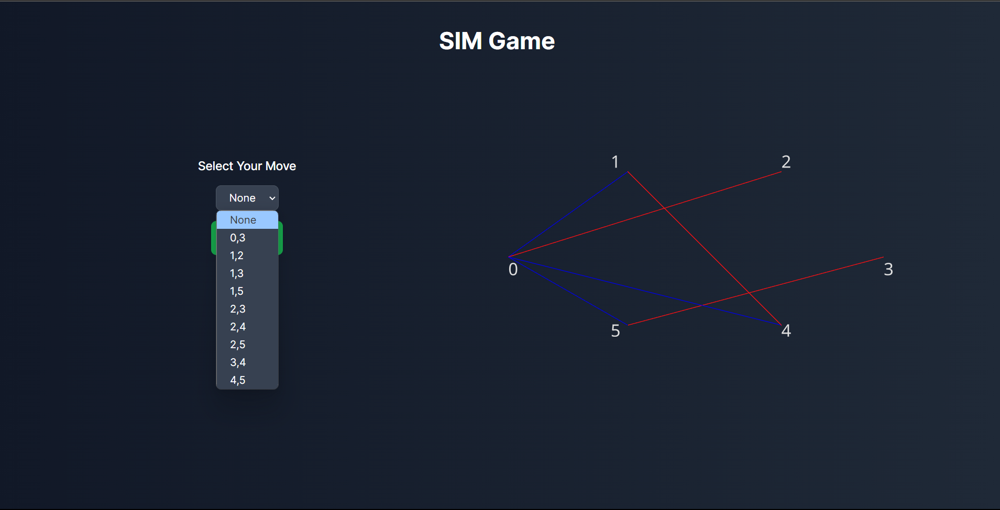

# AI Sim (Pen and paper) Solver

The game and the solver are coded in Python. I implemented them as utilities in the utils.py file in the server directory. The game is designed as a Game class, and the solver is a method called determine_best_next to determine the best next line to draw. I also gave the option to the player to determine the max depth as the difficulty of the game.

I implemented the interface as a web application. The backend in Flask, and the frontend in React.js with Three.js for the drawings.

How to run the app:

 **Running Backend** :

Navigate to the /server directory and run the following two commands:

`pip install -r requirements.txt`

`python app.py`

**Running Frontend** :

Navigate to /client directory and run:

`npm i --force`

`npm run dev`

The app should run at [http://localhost:5173/](http://localhost:5173/)
